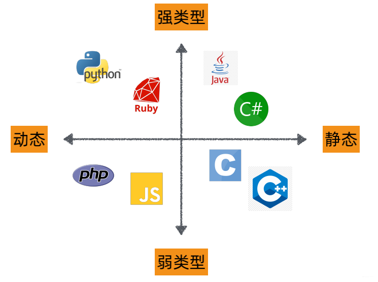

#### OOP的三大特性
封装（数据抽象） 继承 多态（动态绑定）
- 封装是把客观事物封装成抽象的类，并且把部分内部成员进行信息隐藏，分成三种访问控制级别 public private protected
- 继承是子类复用父类的成员，建立相似类型的关系
- 多态分为2种
  - 静态多态：
    - 函数重载、运算符重载
    - 使用类模板、函数模版实现的参数多态
  - 动态多态：虚函数实现的多态，成员函数调用时，根据调用对象的类型执行不同的实现
  <!-- - 类型转换多态 -->

#### C++的动态多态（动态绑定）
运行一个成员函数时，根据调用对象的类型决定执行不同的函数
或者说是 使用基类的引用或指针可以在一定程度上忽略相似类型的区别，进行统一方式使用

#### C++虚函数（多态的实现方式）
对于某些函数，基类希望派生类各自定义自己的，此时基类就把这些函数定义为虚函数

#### 访问控制
类中的成员的访问控制分为三种：
- public 可以被该类中的函数、子类的函数、其友元函数访问,也可以由该类的对象访问
- protected 可以被该类中的函数、子类的函数、以及其友元函数访问,但不能被该类的对象访问
- private 只能由该类中的函数、其友元函数访问,不能被任何其他访问，该类的对象也不能访问.

在继承关系中可以选定继承的方式：
- public继承,父类中的方法属性不发生改变;
- private继承,父类的所有方法在子类中变为private;
- protected继承,父类的protected和public方法在子类中变为protected,private方法不变;

**c++中struct与class基本没有区别，只是struct的成员默认访问控制和默认继承方式的是public，class都是private的**

#### 使用组合代替继承？

#### 友元

#### 多态的使用
使用基类的引用或指针调用一个虚成员函数时，发生动态绑定，编译器产生的代码在运行时才能确定真正执行的函数版本。
如果使用基类去调用一个虚函数，那么在编译阶段其调用的函数版本就确定下来了。
**基类不能使用多态，基类的引用或者指针才可以**

#### 虚函数的实现：虚函数指针、虚函数表
// https://blog.twofei.com/496/
- 当类内定义了虚函数或集成了有虚函数的类时，类对象里就会存在一个虚函数指针，指向虚函数表
  - 虚函数表存在于只读数据段，存放着虚函数指针，每个类，而不是每个对象都会有一个虚函数表，如果派生类定义了基类的某个虚函数，则会修改对应虚函数表中的虚函数指针
- 在继承关系中，会把父类的虚函数表内容继承到派生类，复用父类虚函数表指针
- 在单继承关系中，如果子类重写了父类的虚函数，则虚函数表的对应虚函数指针项会被修改为子类的函数地址
- 如果在多继承关系中，会继承多个父类的虚函数指针，如果重写就覆盖，如果新增就把新增的虚函数指针添加到第一个有虚函数的类的虚函数表中。

<!-- 虚函数指针：在含有虚函数类的对象中，指向虚函数表，在运行时确定。
虚函数表：在程序只读数据段（.rodata section，见：目标文件存储结构），存放虚函数指针，如果派生类实现了基类的某个虚函数，则在虚表中覆盖原本基类的那个虚函数指针，在编译时根据类的声明创建。 -->

#### C++是静态、弱类型类型
静态与动态类型的区别是：编译时期是否确定变量的类型，能确定->静态；不能确定->动态
弱类型与强类型的区别是：不允许隐式类型转换的是强类型，允许隐式类型转换的是弱类型

C++在编译期间即可确定变量类型，so 静态类型
C++允许隐式的类型转换，so 弱类型类型

// 其他语言详细分类： 

#### 类型转换
static_cast, const_cast, reinterpret_cast, or dynamic_cast.

#### 虚继承用来解决菱形继承问题
在继承的时候使用关键字virtual
class c : virtual public a, virtual public b {}
菱形继承会带了命名冲突和空间浪费问题，使用虚继承来解决两个问题
具体实现是在类对象中存储一个虚基类指针，虚基类指针指向虚基类表，虚基类表中存储着虚基类和本类的地址偏移量

#### 类实例大小
- 空类大小：1字节
- 

#### 对齐
- 结构体内成员按照声明顺序存储，第一个成员地址和整个结构体地址相同。
- 未特殊说明时，**按结构体中size最大的成员对齐**（若有double成员，按8字节对齐。）
- 可以用alignas改变默认行为，**若alignas小于自然对齐的最小单位，则失效**